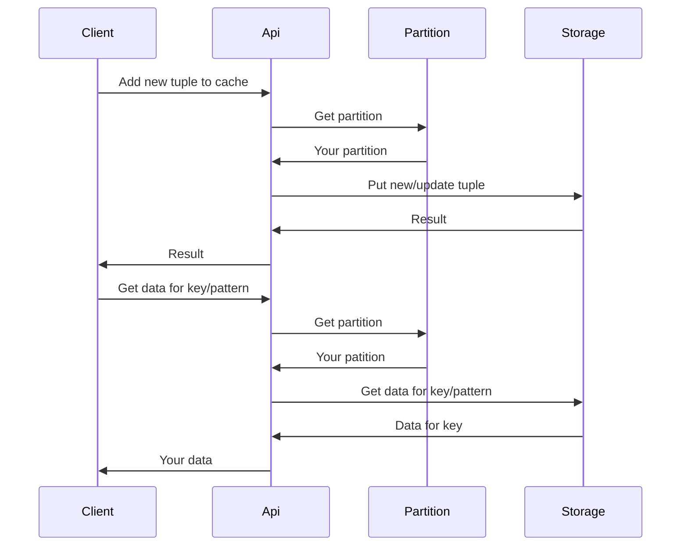
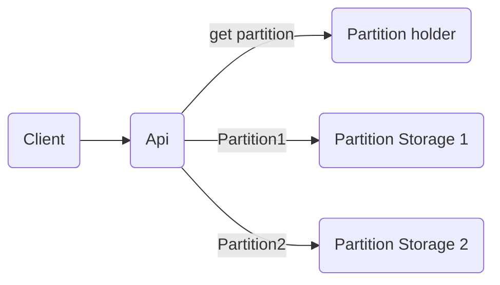

# SuperCache

## Introduce

This is a auto scale & distriubted (in the future) cache library for Elixir. The library use Ets table for storage data.

## Design

 Sequencer flow of api (on a node):



(If diagram doesn't show, please install mermaid support extension for VS Code)

Simple module flow api:



## Installation

Library can be installed
by adding `super_cache` to your list of dependencies in `mix.exs`:

```elixir
def deps do
  [
    {:super_cache, "~> 0.3.0"}
  ]
end
```

Documentation can be generated with [ExDoc](https://github.com/elixir-lang/ex_doc)
and published on [HexDocs](https://hexdocs.pm). Once published, the docs can
be found at <https://hexdocs.pm/super_cache>.

## Guide

Start SuperCache with default config:

```elixir
SuperCache.start()
```
*(key_pos = partition_pos = 0, table_type = :set, num_partition = on_line schedulers of Erlang VM)*

Start with config:

```elixir
opts = [key_pos: 0, partition_pos: 1, table_type: :bag, num_partition: 3]
SuperCache.start(opts)
```

Note:

1. key_pos: Key's position of tuple use to lookup in Ets table.

2. partition_pos: Position of element in tuple is used to calculate partition for store & lookup.

3. table_type: Type of Ets table.

4. num_partition: Number of partitions (= number of Ets table).

Basic usage:

```elixir
opts = [key_pos: 0, partition_pos: 1, table_type: :bag, num_partition: 3]
SuperCache.start(opts)

SuperCache.put({:hello, :world, "hello world!"})

SuperCache.get_by_key_partition(:hello, :world)

SuperCache.delete_by_key_partition(:hello, :world)
```

Other APIs please go to document on hexdocs.pm