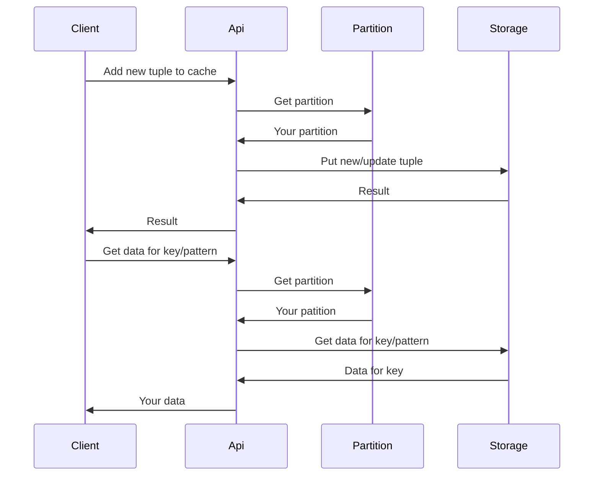
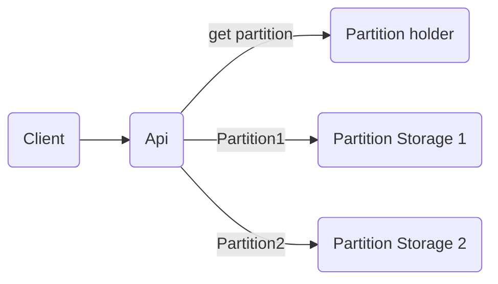

[](https://hexdocs.pm/super_cache)
[](https://hex.pm/packages/super_cache)

# SuperCache

## Introduce

This is a auto scale & distributed (in the future) cache library for Elixir. The library use Ets table for storage data.

## Design


```
Client -> API -> Partition -> Storage
```

Current version, library has three main part:
1. API interface & config holder.
2. Partition holder.
3. Storage partition.
    
### API interface:

Client interacts with library throw qua api interface. All config after start will be hold in this part.

### Partition

Support api get right storage part for data. 

Partition based on Erlang phash2/2. Piece data after extract with config's info will get order of partition. Order is used get target partition.

All partitions will be calculated after client call start/n start!/n function.

### Storage

Storage data of client. Number of storage partition is same with number of partition above.

Core of storage is Ets table.

### call flow of api

Sequencer flow of api (on a node):



(If diagram doesn't show, please install mermaid support extension for VS Code)

Simple module flow api:



## Installation

Requiremnt: Erlang/OTP version 25 or later.

Library can be installed
by adding `super_cache` to your list of dependencies in `mix.exs`:

```elixir
def deps do
  [
    {:super_cache, "~> 0.5.2"}
  ]
end
```

Documentation can be generated with [ExDoc](https://github.com/elixir-lang/ex_doc)
and published on [HexDocs](https://hexdocs.pm). Once published, the docs can
be found at <https://hexdocs.pm/super_cache>.

## Guide

Start SuperCache with default config:

```elixir
SuperCache.start!()
```
*(key_pos = partition_pos = 0, table_type = :set, num_partition = on_line schedulers of Erlang VM)*

Start with config:

```elixir
opts = [key_pos: 0, partition_pos: 1, table_type: :bag, num_partition: 3]
SuperCache.start!(opts)
```

Note:

1. key_pos: Key's position of tuple use to lookup in Ets table.

2. partition_pos: Position of element in tuple is used to calculate partition for store & lookup.

3. table_type: Type of Ets table.

4. num_partition: Number of partitions (= number of Ets table).

Basic usage:

```elixir
opts = [key_pos: 0, partition_pos: 1, table_type: :bag, num_partition: 3]
SuperCache.start!(opts)

SuperCache.put!({:hello, :world, "hello world!"})

SuperCache.get_by_key_partition!(:hello, :world)

SuperCache.delete_by_key_partition!(:hello, :world)
```

KeyValue usage:

```elixir
  alias SuperCache.KeyValue

  # Start cache
  SuperCache.start!()

  KeyValue.add("my_kv", :key, "Hello")
  KeyValue.get("my_kv", :key)
    # => "Hello"

  KeyValue.remove("my_kv", :key)
  KeyValue.get("my_kv", :key)
    # => nil

  KeyValue.add("my_kv", :key, "Hello")
  KeyValue.remove_all("my_kv")
```

Queue usage:

```elixir
alias SuperCache.Queue

# Start cache
SuperCache.start!()

Queue.add("my_queue", "Hello")
Queue.out("my_queue")
  # => "Hello"
```

Stack usage:

```elixir
alias SuperCache.Stack

# Start cache
SuperCache.start!()

Stack.push("my_stack", "Hello")
Stack.pop("my_stack")
  # => "Hello"
```

Other APIs please go to document on [hexdocs.pm](https://hexdocs.pm/super_cache/readme.html)
