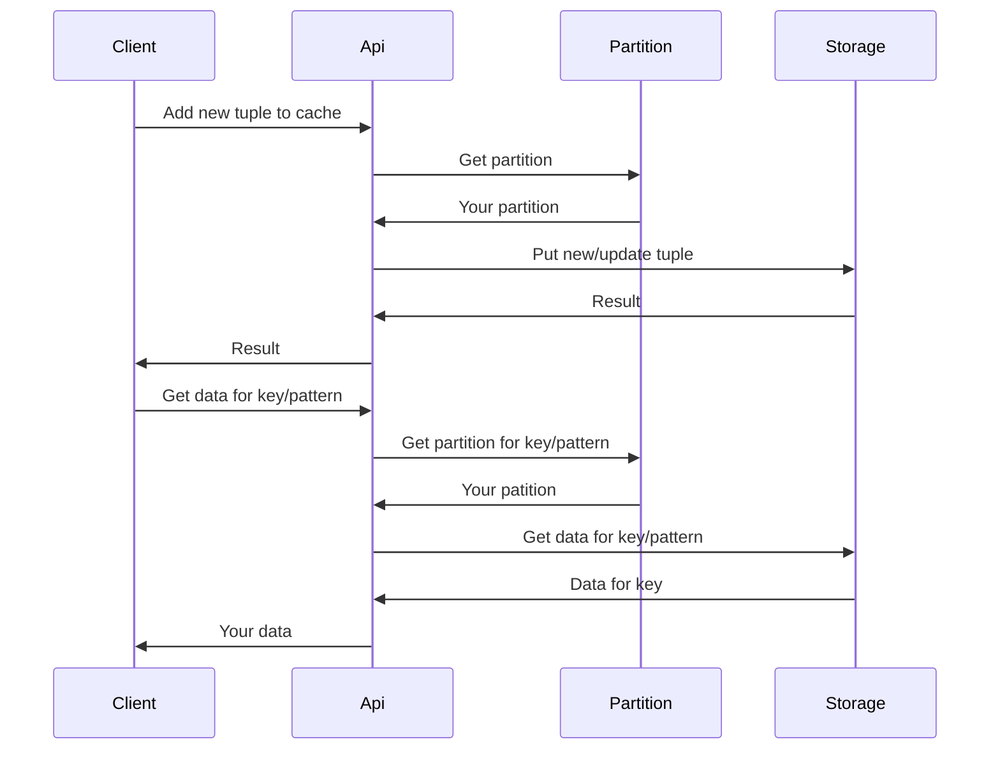
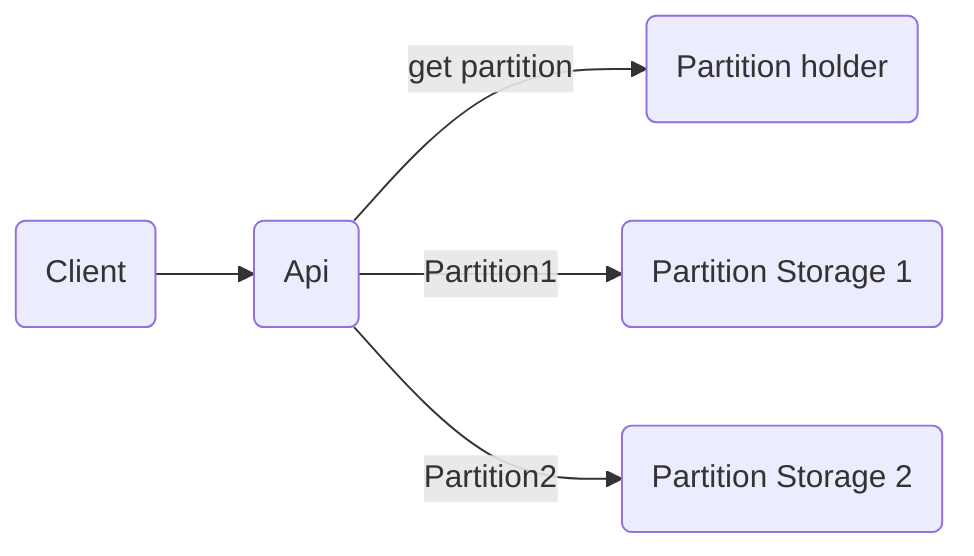

# SuperCache

## Introduce

This is a auto scale & distriubted cache library for Elixir.

## Design

 Sequencer flow of api (on a node):



(If diagram doesn't show, please install mermaid support extension for VS Code)

Simple module flow api:



## Installation

If [available in Hex](https://hex.pm/docs/publish), the package can be installed
by adding `super_cache` to your list of dependencies in `mix.exs`:

```elixir
def deps do
  [
    {:super_cache, "~> 0.1.0"}
  ]
end
```

Documentation can be generated with [ExDoc](https://github.com/elixir-lang/ex_doc)
and published on [HexDocs](https://hexdocs.pm). Once published, the docs can
be found at <https://hexdocs.pm/super_cache>.

