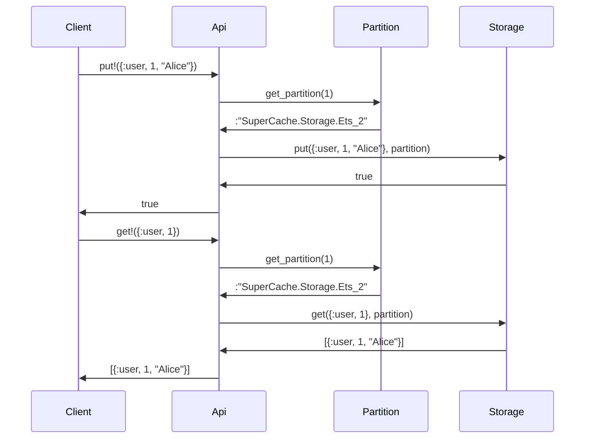
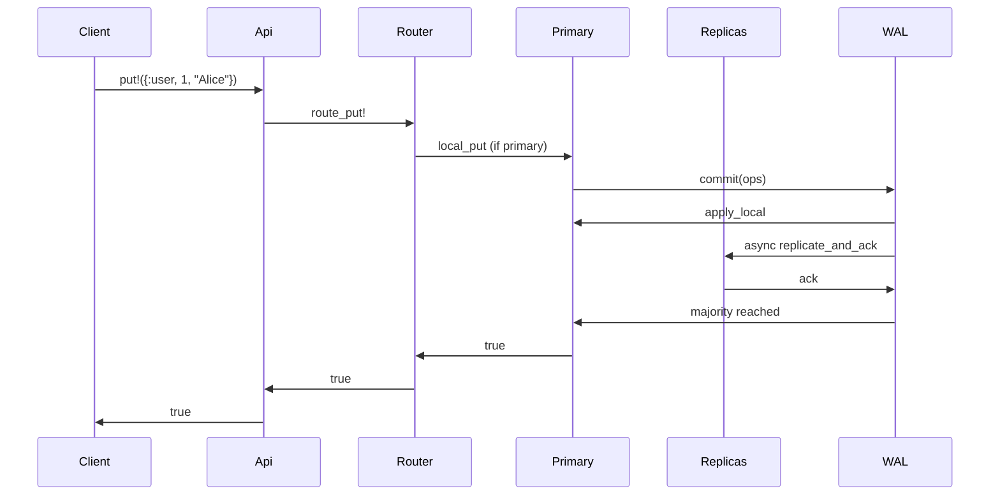

[](https://hexdocs.pm/super_cache)
[](https://hex.pm/packages/super_cache)

# SuperCache

## Introduction

High-performance in-memory caching library for Elixir backed by ETS tables with experimental distributed cluster support. SuperCache provides transparent local and distributed modes with configurable consistency guarantees, batch operations, and horizontal scalability.

## Features

- **Partitioned ETS Storage** — Reduces contention by splitting data across multiple ETS tables
- **Multiple Data Structures** — Tuples, key-value namespaces, queues, stacks, and struct storage
- **Distributed Clustering** — Automatic node discovery, partition assignment, and replication
- **Configurable Consistency** — Choose between async, sync (quorum), or strong (WAL) replication
- **Batch Operations** — High-throughput bulk writes with `put_batch!/1`, `add_batch/2`, `remove_batch/2`
- **Performance Optimized** — Compile-time log elimination, partition resolution inlining, worker pools, and early termination quorum reads

## Design

```
Client → API → Partition Router → Storage (ETS)
                ↓
        Distributed Router (optional)
                ↓
        Replicator → Remote Nodes
```

### Architecture Components

1. **API Layer** — Public interface (`SuperCache`, `KeyValue`, `Queue`, `Stack`, `Struct`)
2. **Partition Layer** — Hash-based routing to ETS tables (`Partition`, `Partition.Holder`)
3. **Storage Layer** — ETS table management (`Storage`, `EtsHolder`)
4. **Cluster Layer** — Distributed coordination (`Manager`, `Replicator`, `WAL`, `Router`)

### Call Flow (Local Mode)


```mermaid
sequenceDiagram
  participant Client
  participant Api
  participant Partition
  participant Storage

  Client->>Api: put!({:user, 1, "Alice"})
  Api->>Partition: get_partition(1)
  Partition->>Api: :"SuperCache.Storage.Ets_2"
  Api->>Storage: put({:user, 1, "Alice"}, partition)
  Storage->>Api: true
  Api->>Client: true
  
  Client->>Api: get!({:user, 1})
  Api->>Partition: get_partition(1)
  Partition->>Api: :"SuperCache.Storage.Ets_2"
  Api->>Storage: get({:user, 1}, partition)
  Storage->>Api: [{:user, 1, "Alice"}]
  Api->>Client: [{:user, 1, "Alice"}]
```

### Call Flow (Distributed Mode)


```mermaid
sequenceDiagram
  participant Client
  participant Api
  participant Router
  participant Primary
  participant Replicas
  participant WAL

  Client->>Api: put!({:user, 1, "Alice"})
  Api->>Router: route_put!
  Router->>Primary: local_put (if primary)
  Primary->>WAL: commit(ops)
  WAL->>Primary: apply_local
  WAL->>Replicas: async replicate_and_ack
  Replicas->>WAL: ack
  WAL->>Primary: majority reached
  Primary->>Router: true
  Router->>Api: true
  Api->>Client: true
```

## Installation

**Requirements**: Erlang/OTP 25 or later, Elixir 1.14 or later.

Add `super_cache` to your dependencies in `mix.exs`:

```elixir
def deps do
  [
    {:super_cache, "~> 1.2"}
  ]
end
```

## Quick Start

### Local Mode

```elixir
# Start with defaults (num_partition = schedulers, key_pos = 0, partition_pos = 0)
SuperCache.start!()

# Or with custom config
opts = [key_pos: 0, partition_pos: 1, table_type: :bag, num_partition: 4]
SuperCache.start!(opts)

# Basic operations
SuperCache.put!({:user, 1, "Alice"})
SuperCache.get!({:user, 1})
# => [{:user, 1, "Alice"}]

SuperCache.delete!({:user, 1})
```

### Key-Value API

```elixir
alias SuperCache.KeyValue

KeyValue.add("session", :user_1, %{name: "Alice"})
KeyValue.get("session", :user_1)
# => %{name: "Alice"}

# Batch operations (10-100x faster than individual calls)
KeyValue.add_batch("session", [
  {:user_2, %{name: "Bob"}},
  {:user_3, %{name: "Charlie"}}
])

KeyValue.remove_batch("session", [:user_1, :user_2])
```

### Queue & Stack

```elixir
alias SuperCache.{Queue, Stack}

# FIFO Queue
Queue.add("jobs", "process_order_1")
Queue.add("jobs", "process_order_2")
Queue.out("jobs")
# => "process_order_1"

# LIFO Stack
Stack.push("history", "page_a")
Stack.push("history", "page_b")
Stack.pop("history")
# => "page_b"
```

### Struct Storage

```elixir
alias SuperCache.Struct

defmodule User do
  defstruct [:id, :name, :email]
end

Struct.init(%User{}, :id)
Struct.add(%User{id: 1, name: "Alice", email: "alice@example.com"})
{:ok, user} = Struct.get(%User{id: 1})
```

## Distributed Mode

### Configuration

All nodes must share identical partition configuration:

```elixir
# config/config.exs
config :super_cache,
  auto_start:         true,
  key_pos:            0,
  partition_pos:      0,
  cluster:            :distributed,
  replication_mode:   :async,  # :async | :sync | :strong
  replication_factor: 2,       # primary + 1 replica
  table_type:         :set,
  num_partition:      8        # Must match across all nodes

# config/runtime.exs
config :super_cache,
  cluster_peers: [
    :"node1@10.0.0.1",
    :"node2@10.0.0.2",
    :"node3@10.0.0.3"
  ]
```

### Replication Modes

| Mode | Guarantee | Latency | Use Case |
|------|-----------|---------|----------|
| `:async` | Eventual consistency | ~50-100µs | High-throughput caches, session data |
| `:sync` | Majority ack (adaptive quorum) | ~100-300µs | Balanced durability/performance |
| `:strong` | WAL-based strong consistency | ~200µs | Critical data requiring durability |

**Async Mode**: Fire-and-forget replication via worker pool. Returns immediately after local write.

**Sync Mode**: Adaptive quorum writes — returns `:ok` once a strict majority of replicas acknowledge, avoiding waits for slow stragglers.

**Strong Mode**: Write-Ahead Log (WAL) replaces heavy 3PC. Writes locally first, then async replicates with majority acknowledgment. ~7x faster than traditional 3PC.

### Read Modes (Distributed)

```elixir
# Local read (fastest, may be stale)
SuperCache.get!({:user, 1})

# Primary read (consistent with primary node)
SuperCache.get!({:user, 1}, read_mode: :primary)

# Quorum read (majority agreement, early termination)
SuperCache.get!({:user, 1}, read_mode: :quorum)
```

**Quorum reads** use early termination — returns as soon as a strict majority agrees, avoiding waits for slow replicas.

### Manual Bootstrap

```elixir
SuperCache.Cluster.Bootstrap.start!(
  key_pos: 0,
  partition_pos: 0,
  cluster: :distributed,
  replication_mode: :strong,
  replication_factor: 2,
  num_partition: 8
)
```

## Performance

### Benchmarks (Local Mode, 4 partitions)

| Operation | Throughput | Notes |
|-----------|-----------|-------|
| `put!` | ~1.2M ops/sec | ~33% overhead vs raw ETS |
| `get!` | ~2.1M ops/sec | Near raw ETS speed |
| `KeyValue.add_batch` (10k) | ~1.1M ops/sec | Single ETS insert |

### Distributed Latency

| Operation | Async | Sync (Quorum) | Strong (WAL) |
|-----------|-------|---------------|--------------|
| Write | ~50-100µs | ~100-300µs | ~200µs |
| Read (local) | ~10µs | ~10µs | ~10µs |
| Read (quorum) | ~100-200µs | ~100-200µs | ~100-200µs |

### Performance Optimizations

1. **Compile-time log elimination** — Debug macros expand to `:ok` when disabled (zero overhead)
2. **Partition resolution inlining** — Single function call with `@compile {:inline}`
3. **Batch ETS operations** — `:ets.insert/2` with lists instead of per-item calls
4. **Async replication worker pool** — `Task.Supervisor` eliminates per-operation `spawn/1` overhead
5. **Adaptive quorum writes** — Returns on majority ack, not all replicas
6. **Quorum read early termination** — Stops waiting once majority is reached
7. **WAL-based strong consistency** — Replaces 3PC with fast local write + async replication + majority ack

### WAL Configuration

```elixir
config :super_cache, :wal,
  majority_timeout: 2_000,  # ms to wait for majority ack
  cleanup_interval: 5_000   # ms between WAL cleanup cycles
```

## API Reference

### SuperCache (Main API)

- `start!/1`, `start/1` — Start cache with options
- `put!/1`, `put/1` — Insert tuple (bang returns `true`, safe returns `{:ok, true}`)
- `put_batch!/1` — Batch insert (10-100x faster for bulk writes)
- `get!/2`, `get/2` — Retrieve by key
- `delete!/1`, `delete/1` — Remove by key
- `delete_all/0` — Clear all partitions
- `get_by_match!/3`, `get_by_match_object!/3` — Pattern matching
- `scan!/3` — Fold over partition records
- `stats/0` — Get cache statistics
- `distributed?/0` — Check if running in distributed mode

### KeyValue

- `add/3`, `get/4`, `remove/2` — Basic operations
- `add_batch/2`, `remove_batch/2` — Batch operations
- `keys/2`, `values/2`, `count/2`, `to_list/2` — Collection operations
- `remove_all/1` — Clear namespace

### Queue

- `add/2`, `out/1`, `peak/1` — FIFO operations
- `count/1`, `get_all/1` — Inspection

### Stack

- `push/2`, `pop/1`, `peak/1` — LIFO operations
- `count/1`, `get_all/1` — Inspection

### Struct

- `init/2` — Initialize struct type with key field
- `add/1`, `get/2`, `remove/1` — CRUD operations
- `get_all/2`, `remove_all/1` — Bulk operations

## Configuration Options

| Option | Type | Default | Description |
|--------|------|---------|-------------|
| `key_pos` | integer | `0` | Tuple index for ETS key lookup |
| `partition_pos` | integer | `0` | Tuple index for partition hashing |
| `num_partition` | integer | schedulers | Number of ETS partitions |
| `table_type` | atom | `:set` | ETS table type (`:set`, `:bag`, `:ordered_set`) |
| `cluster` | atom | `:local` | `:local` or `:distributed` |
| `replication_mode` | atom | `:async` | `:async`, `:sync`, or `:strong` |
| `replication_factor` | integer | `2` | Total copies (primary + replicas) |
| `cluster_peers` | list | `[]` | List of peer node atoms |
| `auto_start` | boolean | `false` | Auto-start on application boot |
| `debug_log` | boolean | `false` | Enable debug logging (compile-time) |

## Debug Logging

Enable at compile time (zero overhead in production):

```elixir
# config/config.exs
config :super_cache, debug_log: true
```

Or toggle at runtime:

```elixir
SuperCache.Log.enable(true)
SuperCache.Log.enable(false)
```

## Health Monitoring

SuperCache includes a built-in health monitor that tracks:

- Node connectivity (RTT via `:erpc`)
- Replication lag (probe-based measurement)
- Partition balance (size variance tracking)
- Operation success rates

Access health data:

```elixir
SuperCache.Cluster.HealthMonitor.health()
SuperCache.Cluster.HealthMonitor.metrics()
```

## Troubleshooting

### Common Issues

**"tuple size is lower than key_pos"** — Ensure your tuples have enough elements for the configured `key_pos`.

**Partition count mismatch** — All nodes in a cluster must have the same `num_partition` value.

**Replication lag** — Check network connectivity between nodes. Use `HealthMonitor.metrics()` to diagnose.

**High memory usage** — Monitor partition sizes with `SuperCache.stats()`. Consider increasing `num_partition` or implementing TTL.

### Performance Tips

1. Use `put_batch!/1` for bulk inserts (10-100x faster)
2. Use `KeyValue.add_batch/2` for key-value bulk operations
3. Prefer `:async` replication mode for high-throughput caches
4. Use `read_mode: :local` when eventual consistency is acceptable
5. Enable compile-time `debug_log: false` for production (default)

## License

MIT License. See [LICENSE](LICENSE) for details.

## Contributing

1. Fork the repository
2. Create a feature branch (`git checkout -b feature/amazing-feature`)
3. Commit your changes (`git commit -m 'Add amazing feature'`)
4. Push to the branch (`git push origin feature/amazing-feature`)
5. Open a Pull Request

Run tests:

```bash
mix test
mix test --exclude cluster  # Skip flaky cluster tests
mix test --warnings-as-errors
```

## Changelog

### v1.1.0

- **WAL-based strong consistency** — Replaces 3PC with ~7x faster writes (~200µs vs ~1500µs)
- **Adaptive quorum writes** — Sync mode returns on majority ack, not all replicas
- **Replication worker pool** — Eliminates per-operation `spawn/1` overhead
- **Batch API optimizations** — `add_batch/2` uses single ETS insert
- **Quorum read early termination** — Stops waiting once majority is reached
- **Compile-time log elimination** — Zero overhead when debug disabled
- **Partition resolution inlining** — Faster hot-path lookups

### v1.0.0

- Initial release with ETS-backed caching
- Distributed mode with 3PC consistency
- Queue, Stack, KeyValue, and Struct APIs
