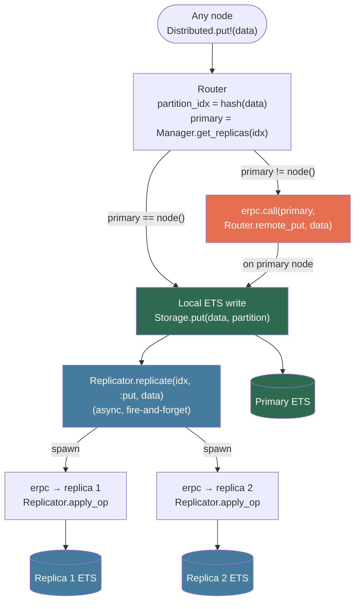

# Api route for distributed

```mermaid
flowchart TD
    Client(["Any node\nDistributed.put!(data)"])
    Router["Router\npartition_idx = hash(data)\nprimary = Manager.get_replicas(idx)"]

    Client --> Router

    Router -->|"primary == node()"| LocalWrite["Local ETS write\nStorage.put(data, partition)"]
    Router -->|"primary != node()"| Forward["erpc.call(primary,\nRouter.remote_put, data)"]

    Forward -->|"on primary node"| LocalWrite

    LocalWrite --> Replicator["Replicator.replicate(idx, :put, data)\n(async, fire-and-forget)"]
    Replicator -->|"spawn"| R1["erpc → replica 1\nReplicator.apply_op"]
    Replicator -->|"spawn"| R2["erpc → replica 2\nReplicator.apply_op"]

    R1 --> ETS1[("Replica 1 ETS")]
    R2 --> ETS2[("Replica 2 ETS")]
    LocalWrite --> ETS0[("Primary ETS")]

    style LocalWrite fill:#2d6a4f,color:#fff
    style Forward fill:#e76f51,color:#fff
    style Replicator fill:#457b9d,color:#fff
    style ETS0 fill:#2d6a4f,color:#fff
    style ETS1 fill:#457b9d,color:#fff
    style ETS2 fill:#457b9d,color:#fff
```
